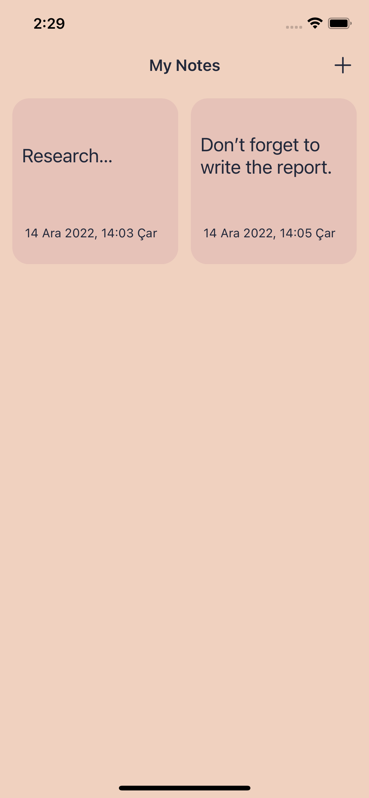

# My Notes
> This is a simple note-taking application. 

## General Information
- This application allows users to take simple notes and save them to their local devices.
- Users can create new notes and update & delete them.
- The purpose of this project is to study Codable Protocol for saving custom objects into a plist and storing the data in the local device. 

## Features
- Creating notes when the plus button on the top right corner is tapped
- Tapping on a specific note to open it
- Deleting or updating the note after opening it

## Screenshots
img src="images/NewNote.png" width = "234" height = "506">  

## Setup
To open this project locally, clone the project and open it in Xcode.

## Project Status
Project is _complete_.

## Room for Improvement
- A voice recording feature can be added.
- A feature to change the note pages' colors can be added.

## Acknowledgements
- This project is prepared for the [iOS & Swift - The Complete iOS App Development Bootcamp](https://www.udemy.com/course/ios-13-app-development-bootcamp/) course, but it is changed and modified to study a specific part of the lesson: saving the data locally using the Codable Protocol.

